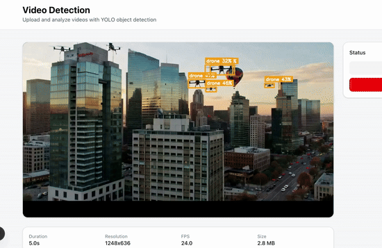

# SkyLaneAI

**AI-Powered Sky Hazard Detection for Flying Taxis**

## What is SkyLaneAI?

SkyLaneAI protects flying taxis and aerial vehicles from collisions by detecting sky hazards in real-time. Upload a video or connect a live camera feed, and our AI identifies birds, drones, balloons, and kites—calculating collision risk and providing instant alerts.



## Key Features

- **Video Analysis**: Upload videos to detect and track sky hazards
- **Smart Detection**: AI identifies birds, drones, balloons, and kites with visual overlays
- **Multi-Agent AI System**: Powered by LangGraph with specialized agents working together to analyze detections, assess context, and generate intelligent alerts
- **Interactive Timeline**: See all detected hazards throughout your video
- **Context-Aware Alerts**: AI agents understand patterns and generate natural language safety warnings
- **Filter & Search**: Focus on specific hazard types or severity levels

## How It Works

1. **Upload** a video through the web interface
2. **AI analyzes** each frame using advanced zero-shot object detection (YOLO-World)
3. **Multi-agent system** processes detections through specialized LangGraph agents:
   - **Alert Agent**: Orchestrates the analysis workflow
   - **Context Agent**: Analyzes detection patterns and environmental context
   - **Message Agent**: Generates natural language alerts and recommendations
4. **View results** with bounding boxes, labels, and an interactive timeline
5. **Review intelligent alerts** with context-aware safety recommendations

**Coming Soon**: Live camera feed analysis with real-time collision warnings based on Time-to-Contact calculations.

## Quick Start

### Prerequisites

- Node.js (v20+) and pnpm
- Python (v3.11+)
- OpenAI API key

### Installation

```bash
# Clone the repository
git clone https://github.com/samiur-r/SkyLaneAI.git
cd SkyLaneAI

# Install dependencies
npm install -g pnpm
pnpm install

# Set up backend
cd apps/api
python -m venv venv
source venv/bin/activate  # On Windows: venv\Scripts\activate
pip install -r requirements.txt
```

### Configuration

Create `.env.local` in `apps/web`:
```env
NEXT_PUBLIC_API_URL=http://localhost:8000
```

Create `.env` in `apps/api`:
```env
OPENAI_API_KEY=your_openai_api_key
```

### Run the Application

**Terminal 1 - Frontend:**
```bash
pnpm --filter web dev
```

**Terminal 2 - Backend:**
```bash
cd apps/api
source venv/bin/activate
uvicorn app.main:app --reload --host 0.0.0.0 --port 8000
```

Visit [http://localhost:3000](http://localhost:3000) to start using SkyLaneAI.

## Technology Stack

- **Frontend**: Next.js, TypeScript, Tailwind CSS, shadcn/ui
- **Backend**: FastAPI (Python), YOLO-World, OpenCV
- **AI Multi-Agent System**:
  - **LangGraph**: Agent orchestration and workflow management
  - **OpenAI GPT**: Powers intelligent decision-making across specialized agents
  - **Agent Architecture**: Modular design with Alert, Context, and Message agents working in coordination

## Documentation

Visit `/docs` in the application for detailed guides on features, technology, and usage.

## Project Structure

```
SkyLaneAI/
├── apps/
│   ├── web/          # Next.js frontend
│   └── api/          # FastAPI backend
├── packages/         # Shared code
└── README.md
```

## Contributing

We welcome contributions! Please:
1. Fork the repository
2. Create a feature branch
3. Submit a pull request

## Support

- **Issues**: [GitHub Issues](https://github.com/samiur-r/SkyLaneAI/issues)
- **Email**: samiur.rahman.akif@gmail.com
- **Docs**: Available at `/docs` in the app

## License

MIT License - See [LICENSE](LICENSE) file for details.

---

*Building safer skies through AI innovation*
